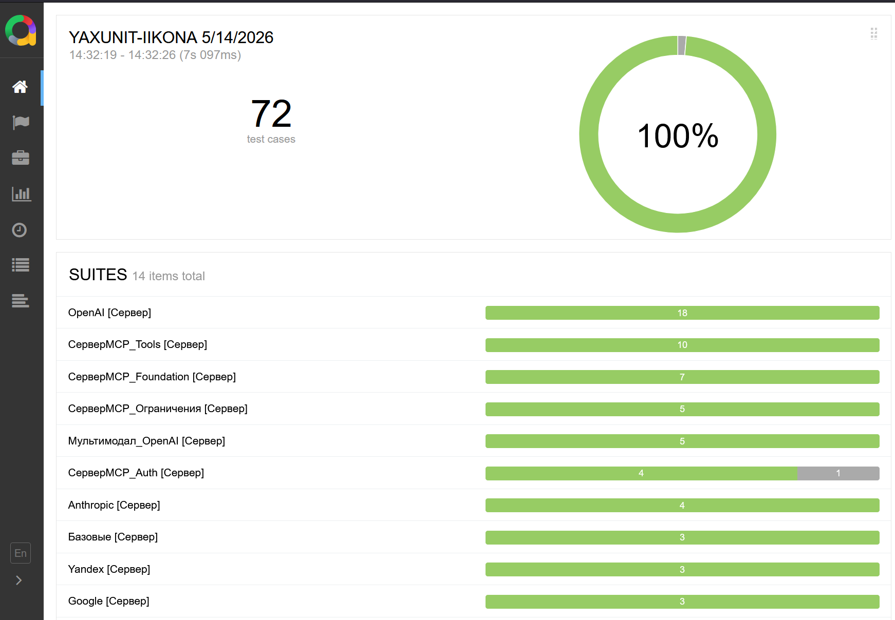
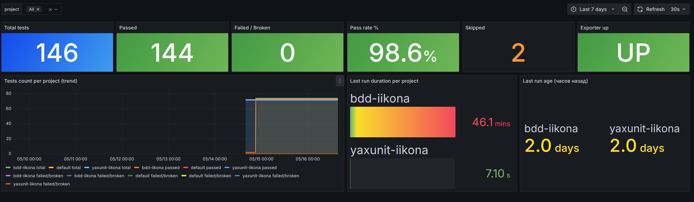
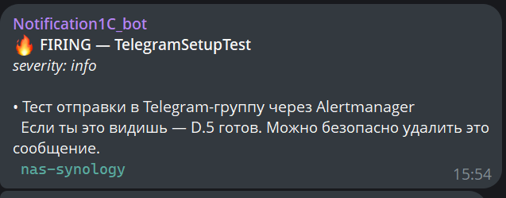

# onec-yaxunit-ci-template

CI-шаблон для прогона **YAxUnit unit-тестов 1С** через Gitea / GitHub Actions с автоматической публикацией отчётов в **Allure dashboard**. Готов к адаптации под любой 1С-проект за 30 минут.

**Стек**: 1С Платформа 8.3.x + YAxUnit kernel + vanessa-runner (vrunner) + Gitea Actions self-hosted Windows runner + frankescobar/allure-docker-service.

## Что внутри

```
.gitea/workflows/yaxunit-smoke.yml      # Gitea Actions workflow
.github/workflows/yaxunit-smoke.yml     # GitHub Actions equivalent (тот же стек)
ci/
├── run-yaxunit-smoke.ps1               # PowerShell wrapper: pre-flight + vrunner + JUnit-парсинг
├── junit_to_allure_impl.py             # JUnit XML → Allure raw JSON converter (stdlib only)
├── junit-to-allure.py                  # CLI обёртка вокруг converter'а
├── upload-to-allure.py                 # E2E uploader (find newest XML → convert → upload → generate report)
├── vanessa-bdd-to-allure.py            # Bonus: BDD pipeline через Vanessa MCP → Allure (interactive only)
└── vanessa-mcp.py                      # JSON-RPC helper для Vanessa MCP (нужен BDD bonus, stdlib only)
examples/
├── config-reference.md                 # Референс — какие значения куда подставлять
├── screenshots/                        # Как это выглядит вживую (Allure / Grafana / Telegram)
└── monitoring/                         # Опциональный стек: Allure + Prometheus + Grafana + Telegram (Шаг 6)
```

## Что даёт

**До**: `1cv8.exe ENTERPRISE /C "RunUnitTests=config.json"` руками, читаешь log в консоли.

**После**: push в репозиторий → CI прогоняет N модулей YAxUnit → отчёт со всеми тестами в Allure UI с trend-графиками pass/fail между прогонами + опциональный Grafana dashboard с Telegram-алертами.

## Pre-requisites

| Что | Где взять | Зачем |
|---|---|---|
| **1С Платформа** 8.3.x | 1c.ru | Runtime |
| **YAxUnit-NN.MM.cfe** | [bia-technologies/yaxunit releases](https://github.com/bia-technologies/yaxunit/releases) | Test framework |
| **OneScript + vanessa-runner** | `choco install onescript` → `opm install vanessa-runner` | CLI обвязка над 1С |
| **Python 3.10+** на runner-машине (как `py -3` / `py -3.14`) | python.org / Microsoft Store | Конвертер JUnit XML → Allure raw + uploader (stdlib only, без pip-зависимостей) |
| **Self-hosted runner** Windows | Gitea Actions / GitHub Actions registration | Где будет крутиться job |
| **Docker host** (NAS / VM / cloud) | для Allure server container | History reports |
| _(опционально)_ **vanessa-add** | `opm install add` | Только для BDD через `vanessa-bdd-to-allure.py` (не для YAxUnit unit) |
| _(опционально)_ **Prometheus + Grafana** | Docker (есть в `examples/monitoring/`) | Дашборд тестовых метрик + Telegram-алерты |

Версии тестировались: 8.3.27.1989, YAxUnit 25.12, vrunner 2.6.1, allure-docker-service 2.38.1, Python 3.14. Должно работать на смежных версиях.

## Quick start (30 минут)

### 1. Поднять Allure server

```bash
# На NAS / VM / любой Docker host
docker run -d --name allure --restart unless-stopped \
  -p 5050:5050 \
  -v $(pwd)/allure-projects:/app/projects \
  -e CHECK_RESULTS_EVERY_SECONDS=NONE \
  -e KEEP_HISTORY=1 -e KEEP_HISTORY_LATEST=20 \
  frankescobar/allure-docker-service:2.38.1

# Дождаться полного старта (~3 сек) — иначе первый POST упадёт с псевдо-permission ошибкой
until curl -sf http://localhost:5050/allure-docker-service/version > /dev/null 2>&1; do sleep 1; done

# Создать project
curl -X POST -H "Content-Type: application/json" \
  -d '{"id":"your-project-id"}' \
  http://localhost:5050/allure-docker-service/projects
```

> Если планируешь мониторинг (Шаг 6) — пропусти этот шаг: единый `docker-compose.yml` из `examples/monitoring/` поднимает Allure сам.

### 2. Зарегистрировать Windows runner

```cmd
:: Скачать act_runner для Gitea (или actions/runner для GitHub)
act_runner.exe register ^
  --instance http://your-gitea:3000 ^
  --token <registration-token> ^
  --labels "windows-1c,self-hosted,windows,x64" ^
  --name "your-runner-name"

:: Опция А — daemon в user-session (interactive)
act_runner.exe daemon

:: Опция Б — Windows-сервис через WinSW/NSSM (см. Gotcha 1)
```

### 3. Подготовить тестовое расширение в EDT

В YAxUnit-расширении создать модуль:

```bsl
#Область ПрограммныйИнтерфейс
Процедура ИсполняемыеСценарии() Экспорт
    ЮТТесты.ДобавитьТестовыйНабор("Smoke")
        .ДобавитьСерверныйТест("ДваПлюсДваРавноЧетыре");
КонецПроцедуры
#КонецОбласти

#Область СлужебныеПроцедурыИФункции
Процедура ДваПлюсДваРавноЧетыре() Экспорт
    ЮТест.ОжидаетЧто(2 + 2).Равно(4);
КонецПроцедуры
#КонецОбласти
```

В `.mdo` модуля **обязательно** `<server>true</server>` — иначе YAxUnit не увидит тесты (см. Gotcha 4).

### 4. Заполнить workflow yml

Открой `.gitea/workflows/yaxunit-smoke.yml` (для Gitea) или `.github/workflows/yaxunit-smoke.yml` (для GitHub). Поменяй конкретные строки:

**В блоке `env:`**:
- `ALLURE_PROJECT_ID: "your-project-id"` — id из шага 1
- `ALLURE_URL: "http://your-nas:5050"` — URL Allure server
- `EXECUTOR_URL` — URL твоего CI репо
- `ONEC_PLATFORM_VERSION: "8.3.27.1989"` — твоя версия платформы

**В шаге `Run YAxUnit smoke wrapper`** (флаги PowerShell):
- `-BasePath "C:\1C Bases\YOUR_BASE"` — путь к ИБ на runner-машине (**обязательный** параметр)
- `-BaseUser "ci-user"` — **ASCII** имя пользователя ИБ (см. Gotcha 2)
- `-BasePass "${{ secrets.ONEC_BASE_PASS }}"` — пароль из secrets, **не хардкодить**
- `-ModuleName "Тесты_СмокYAXUnit"` — твой smoke-модуль (default в wrapper'е — один smoke-модуль; для полного набора передай `-ModuleNames @('Тесты_X','Тесты_Y')`)
- `-V8Version "8.3.27.1989"` — твоя версия платформы

**Секрет**: добавь `ONEC_BASE_PASS` в Gitea Settings → Actions → Secrets → New Secret (для GitHub — Settings → Secrets and variables → Actions). Пароль ИБ **никогда** не хардкодится в скрипте.

### 5. Прогон

Push в репозиторий → workflow стартует → через 30-90 секунд видишь результат в Allure:

```
http://your-nas:5050/allure-docker-service/projects/your-project-id/reports/latest/index.html
```



*Реальный прогон проекта [ИИкона](https://github.com/andromanpro/1c-ai-connector) — 72 теста, 14 suites, ~7 секунд.*

### 6. Мониторинг + Telegram-алерты (опционально)

Если хочется узнавать о красных тестах из Telegram, не из открытого браузера — есть готовый стек в `examples/monitoring/`.

> **Важно:** этот шаг **заменяет** шаг 1 (`docker run` allure-docker-service). Единый `docker-compose.yml` поднимает И Allure, И мониторинг в одной сети — `allure-exporter` сам резолвит `allure:5050`, ручная настройка сети не нужна. Если уже запустил Allure отдельным `docker run` из шага 1 — останови его, иначе конфликт порта 5050.

**Что даёт:**

- **Grafana dashboard** «Allure CI — тесты и тренды»: pass/fail по проектам, длительность последнего прогона, процент успешных в динамике, статус всех проектов
- **Prometheus** хранит метрики 30 дней (история pass-rate, регрессии, рост числа тестов)
- **Alertmanager → Telegram**: при `failed > 0`, контейнер перезапустился, диск >90%, память >90% — летит сообщение в чат
- **node-exporter + cAdvisor**: метрики хоста и Docker-контейнеров, чтобы заодно видеть здоровье runner-машины

**Стек:**

```
examples/monitoring/
├── docker-compose.yml                 # единый compose: Allure + 6 контейнеров мониторинга
├── prometheus/
│   ├── prometheus.yml                 # scrape config (4 target: prom, node, cadvisor, allure)
│   └── rules/basic.yml                # 5 алертов: DiskFull, HighMemory, ContainerRestart, AllureCIFailing, AllureExporterDown
├── alertmanager/
│   └── config.yml.example             # Telegram template — заполнить bot_token + chat_id
├── allure-exporter/
│   ├── exporter.py                    # 80 строк stdlib Python — опрашивает Allure widget summary, выдаёт Prometheus-метрики
│   └── Dockerfile                     # python:3.12-alpine
└── grafana/
    └── allure-ci-dashboard.json       # импортить через Grafana → Dashboards → Import
```

**Quick start мониторинга:**

```bash
cd examples/monitoring

# 1. Создать Telegram-бота через @BotFather, узнать chat_id (см. инструкцию внутри config.yml.example)
cp alertmanager/config.yml.example alertmanager/config.yml
# Подставить реальный bot_token и chat_id

# 2. Запустить ВСЁ одной командой (Allure + мониторинг в одной сети)
docker compose up -d

# 2a. Дождаться готовности Allure (защита от race из Gotcha 5)
until curl -sf http://localhost:5050/allure-docker-service/version > /dev/null 2>&1; do sleep 1; done

# 3. Создать Allure project (Allure уже поднят этим compose)
curl -X POST -H "Content-Type: application/json" \
  -d '{"id":"your-project-id"}' \
  http://localhost:5050/allure-docker-service/projects

# 4. Открыть сервисы
#    Allure:  http://<host>:5050
#    Grafana: http://<host>:3001 — admin / пароль из GF_SECURITY_ADMIN_PASSWORD
#    В Grafana: Add data source → Prometheus → URL: http://prometheus:9090
#    Dashboards → Import → загрузить grafana/allure-ci-dashboard.json

# 5. Проверить алерт-канал
curl -X POST -H "Content-Type: application/json" \
  -d '[{"labels":{"alertname":"Test","severity":"info"},"annotations":{"summary":"test from setup"}}]' \
  http://localhost:9093/api/v2/alerts
# В Telegram должно прилететь сообщение через ~30 секунд
```

После этого пуш с упавшим тестом → через минуту в чате `🔥 FIRING — AllureCIFailingTests`. После починки → `✅ RESOLVED`.





⚠️ `alertmanager/config.yml` с реальным bot-токеном — **не коммитить**. В `examples/monitoring/.gitignore` уже прописано исключение, в репозитории живёт только `config.yml.example`.

⚠️ **Безопасность:** Grafana по умолчанию включает анонимный доступ, Prometheus и Allure работают без аутентификации. Эта конфигурация — для изолированной доверенной сети (домашний NAS, внутренняя VM). **Не выставляйте порты `5050`, `9090`, `3001`, `9093` в публичный интернет без reverse proxy с HTTPS и аутентификацией.**

## Gotchas (грабли на которых мы споткнулись)

### 1. ExecutionPolicy под LocalSystem-сервисом

Если runner работает как Windows-сервис (LocalSystem) — `shell: powershell` падает с `PSSecurityException: UnauthorizedAccess`. Restricted policy блокирует dot-source временного `0.ps1` **до** выполнения тела шага. Лекарство — `shell: cmd` + явный `powershell -ExecutionPolicy Bypass -File` (что и сделано в шаблоне).

### 2. Кириллица в credentials → ASCII-пользователь

`1cv8.exe ENTERPRISE /N "Администратор" /P "..."` через managed runtime (PowerShell / vrunner / Python subprocess) **не передаёт кириллицу корректно** — auth fail. Создай в инфобазе ASCII-юзера типа `ci-user` — это обходит Win32 charset border.

### 3. User PATH под LocalSystem

`vrunner.bat` зовёт `oscript` без полного пути. Под user-сессией это работает (ovm добавляет в user PATH). Под LocalSystem user PATH не наследуется. Wrapper расширяет `$env:Path` через `Split-Path -Parent $VrunnerExe` — fix включён.

### 4. YAxUnit «0 сценариев»

Тестовый CommonModule не имеет `<server>true</server>` в `.mdo`. YAxUnit парсит только серверные модули. Через [codepilot1c MCP](https://github.com/ondysss/codepilot1c-edt) → `update_metadata` или вручную в EDT.

### 5. Allure first POST с пустым проектом — `Permission denied`

Контейнер `frankescobar/allure-docker-service` имеет race: flask app начинает listening раньше чем завершены init-scripts. Первый `POST /projects` в окне 1-5 сек после `docker run` возвращает 400 с псевдо-permission. **Не chown**, а **health-poll на `/version`** — что и сделано в Quick start выше.

### 6. BDD CI через Vanessa Automation — НЕ работает под Session 0

Vanessa Automation шлёт WM_-сообщения для UI-автоматизации, под Windows-сервисом (Session 0) их некому слушать. **Этот template — только для YAxUnit (серверные unit-тесты)**. Для BDD используй `ci/vanessa-bdd-to-allure.py` руками в interactive-сессии (см. секцию BDD bonus ниже).

## Troubleshooting — CI красный, что проверить

| Симптом в логах | Что значит | Где смотреть |
|---|---|---|
| `PSSecurityException: UnauthorizedAccess` | Runner как сервис, dot-sourcing `0.ps1` упёрся в Restricted policy | Gotcha #1 |
| `Пользователь ИБ не идентифицирован` (за 1-2 сек) | Кириллический user через managed runtime — charset border | Gotcha #2 |
| `'oscript' is not recognized` | LocalSystem не видит user PATH | Gotcha #3 |
| `Загрузка сценариев завершена. 0 сценариев` | `<server>true</server>` отсутствует в `.mdo` тестового модуля | Gotcha #4 |
| HTTP 400 `Permission denied: '/app/...'` от Allure | Слишком ранний POST после `docker run` (race с init) | Gotcha #5 |
| 10-минутный hang без вывода в логах | Запустил BDD под сервис вместо unit | Gotcha #6 |
| `Bind mount failed: '/var/lib/docker' does not exist` | На Synology Docker root = `/volume1/@docker` | Inspect: `docker info \| grep Root` |
| `'(1,1)' Обнаружено логическое завершение` | Невидимый Unicode (U+2011/U+00AD/U+00A0) в первой строке `.bsl` | `xxd Module.bsl \| head -3` |

## Когда **не** подойдёт этот template

- **Управляемые формы UI-тесты** — нужен interactive runner (см. Gotcha 6); для BDD есть `vanessa-bdd-to-allure.py`, но прогон ручной, не CI
- **Тесты с lifecycle БД** (миграции / РАУЗ / закрытие месяца) — нужны fixtures, этот template не покрывает
- **Параллельный прогон** на одной инфобазе — невозможно, lock на extension. Решается копированием баз (`proj-m1`, `-m2` …)

## BDD bonus (опционально)

`ci/vanessa-bdd-to-allure.py` + `ci/vanessa-mcp.py` (JSON-RPC helper, в комплекте) — самодостаточный pipeline для BDD-тестов через Vanessa Automation MCP в interactive-сессии. Шлёт результаты в тот же Allure server, что и YAxUnit, но в отдельный project.

```bash
# 1. Установить vanessa-add
opm install add

# 2. Поднять Vanessa менеджер + test-client (через свой launcher .bat)
#    Vanessa MCP сервер (client_mcp) должен слушать http://127.0.0.1:8080/mcp
#    — vanessa-mcp.py ходит туда по JSON-RPC. См. https://github.com/Pr-Mex/vanessa-automation

# 3. Запустить feature и сразу залить результат в Allure (отдельный project)
py -3 ci/vanessa-bdd-to-allure.py --project bdd-yourproject --feature path/to/smoke.feature
```

> Прогон ручной (Vanessa требует interactive-десктоп, не работает под Windows-службой — см. Gotcha 6). Если Vanessa MCP слушает на другом адресе/порту — переопредели через env `VANESSA_MCP_HELPER` (путь к helper) или поправь `URL` в `ci/vanessa-mcp.py`.

## Лицензия

MIT. Используй, форкай, адаптируй, встраивай в коммерческие продукты — без вопросов.

## Источники / реальный путь

Этот template вырос из реальной CI-инфраструктуры проекта **[ИИкона](https://github.com/andromanpro/1c-ai-connector)** — открытый AI-коннектор для 1С:Предприятие. От первого прогона на ноутбуке до зелёного Gitea Actions с Allure dashboard — за один рабочий день. Подробный разбор пути — в статье **«Я хотел CI для тестов 1С. Получил шесть граблей и одну DeepSeek-галлюцинацию»** (готовится к публикации на androman.pro + Хабр / Инфостарт).

См. `examples/config-reference.md` — обобщённый референс какие значения куда подставлять.

## Связанные проекты

- [YAxUnit](https://github.com/bia-technologies/yaxunit) — test framework
- [vanessa-runner](https://github.com/vanessa-opensource/vanessa-runner) — CLI обвязка
- [vanessa-add](https://github.com/vanessa-opensource/add) — расширения для vrunner (BDD)
- [Vanessa Automation](https://github.com/Pr-Mex/vanessa-automation) — BDD framework
- [allure-docker-service](https://github.com/fescobar/allure-docker-service) — Allure server
- [act_runner](https://gitea.com/gitea/act_runner) — Gitea Actions runner
